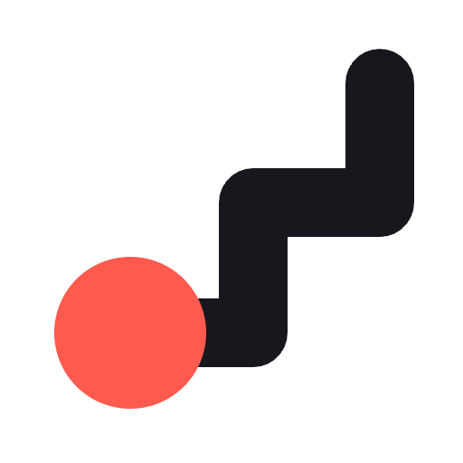
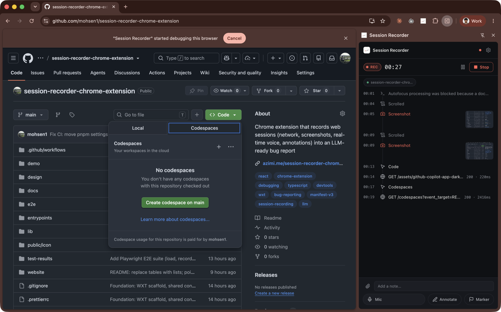
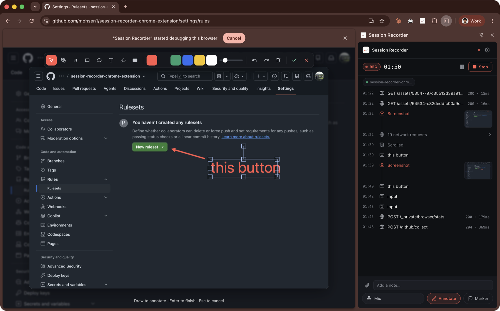
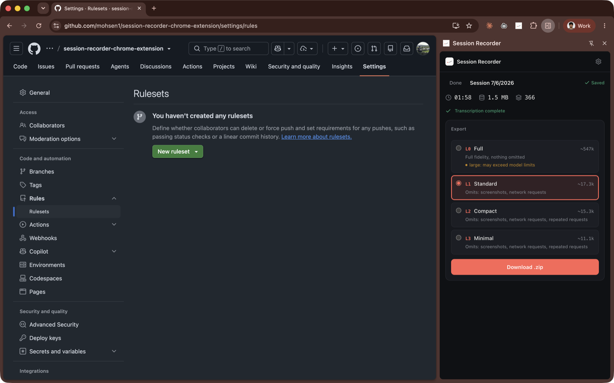

<p align="center">
  
</p>

<h1 align="center">Session Recorder</h1>

<p align="center">
  Record a bug. Hand your AI agent the whole story.
</p>

Reproducing a bug for an AI coding agent means describing a hundred little
things: what you clicked, what the app requested, the error in the console, what
you expected. Session Recorder captures all of it while you use your app, then
exports one clean report your agent can read.

Website: [azimi.me/session-recorder-chrome-extension](https://azimi.me/session-recorder-chrome-extension/)

<p align="center">
  
</p>

## What you get

- one timeline of everything that happened, in order: clicks, typing, page
  changes, network requests and their responses, console errors, and screenshots
- your own voice, transcribed in real time and slotted in next to what you were
  doing, so the report reads like you walking the agent through it
- arrows and boxes you draw right on the page, saved into the report as an image
- a report sized to fit your model, with a live token estimate for each level
- secrets hidden by default and nothing uploaded: it all stays on your machine

### Point at the problem

Freeze the screen and mark it up. The annotated image goes straight into the
report, so your agent sees the exact thing you meant.

<p align="center">
  
</p>

### Right-sized for any model

Long sessions get big. Pick a level and see the estimated token count before you
export. The same recording can be re-exported at any level later. Your explicit
signals — voice, annotations, markers, notes, and errors — are never trimmed.

<p align="center">
  
</p>

### Secrets stay secret

Passwords, auth headers, and tokens are masked before anything is saved. You can
add your own rules or turn masking off per session in the settings.

## Install (load unpacked)

```bash
pnpm install
pnpm build            # -> .output/chrome-mv3
```

In Chrome, open `chrome://extensions`, enable Developer mode, click Load
unpacked, and select `.output/chrome-mv3`. Click the toolbar icon to open the
side panel, then click Record.

> While recording, Chrome shows a "... is being debugged" banner. That is how
> the extension taps the network and console streams. If the debugger cannot
> attach, the session still records interactions, navigation, voice,
> annotations, and files, and the report notes the gap.

## Develop and test

```bash
pnpm dev              # WXT dev server with HMR
pnpm compile          # typecheck
pnpm test             # unit and integration tests (vitest)
pnpm test:e2e         # Playwright end-to-end (add :headed for a visible browser)
```

The end-to-end suite in [`e2e/`](./e2e) loads the built extension into
Chromium, records a session against the bundled [`demo/`](./demo) page, exports
through the real side-panel UI, and checks the zip: the report contains the
actions and marker, and a typed password appears nowhere in the output.

## Voice narration and transcription (optional)

Talk while you record to explain what's happening. With Deepgram (Nova-3)
configured, the extension transcribes in real time over a streaming websocket.
Each utterance lands on the timeline stamped at the moment you began speaking,
so the report reads: narration "while clicking 'Checkout'". OpenAI
(gpt-4o-transcribe) and ElevenLabs (Scribe v2) transcribe in batches instead.

Set the provider, model, and API key on the options page. The key stays in
`chrome.storage.local`. Without a key, sessions keep the raw audio.

## Using a report with an LLM agent

Unzip the export and give `report.md` to your coding agent. It is a
chronological narrative with `[mm:ss]` timestamps joining interactions, network
summaries, errors, narration, and annotations. At L2 and L3 it stands alone
without the asset files. See [`docs/report-format.md`](./docs/report-format.md)
for a suggested prompt.

## Why we need each permission

- `debugger`: network, console, and exception capture through CDP
- `sidePanel`: the recording and export UI
- `tabs` and `webNavigation`: multi-tab tracking and navigation events
- `scripting`: content-script activation
- `storage` and `unlimitedStorage`: sessions live in IndexedDB
- `offscreen`: `MediaRecorder` for voice
- `downloads`: save the exported zip
- `alarms`: flush the event buffer while recording
- `<all_urls>`: record whatever app you point it at

## Under the hood

For contributors: the extension captures network and console through
`chrome.debugger`, navigation through `chrome.webNavigation`, and interactions
through content scripts. Voice records in an offscreen document; screenshots come
from the debugger. Everything flows through one funnel in the background service
worker into IndexedDB, and trimming at export is deterministic (no LLM). The full
design is in [`PLAN.md`](./PLAN.md) and [`IMPLEMENTATION.md`](./IMPLEMENTATION.md).

## Project layout

```
entrypoints/         background (orchestrator), 3 content scripts,
                     sidepanel + options (React), offscreen + mic-permission
lib/session/         frozen contract: types, event registry, settings, messaging
lib/capture/         debugger, network, console, screenshots, multitab, redaction
lib/export/          trimmer, markdown renderer, shape-summary, tokens, zip, bundle
lib/transcription/   provider interface + OpenAI-compatible / Deepgram / ElevenLabs
lib/storage/         IndexedDB layer + batched event writer
e2e/                 Playwright end-to-end suite
demo/                local test page that exercises every capture path
```

## Not in v1

Video recording, backend upload and shareable links, LLM-powered summarization,
Firefox and Safari ports, and DOM snapshot replay. See [`PLAN.md`](./PLAN.md)
§11.
